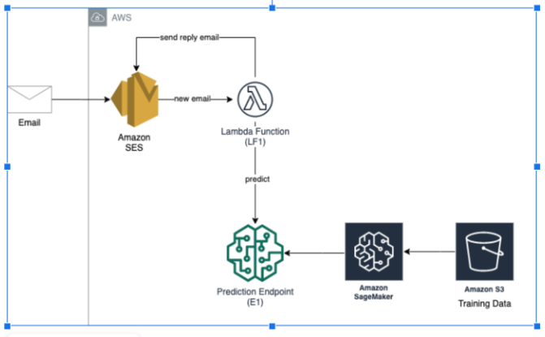

# AWS-Email-Spam-Detector
Email Spam Detection using AWS Services
A machine learning model to predict whether a message is spam or not. Upon receipt of an email message, this application will automatically flag it as spam or not, based on the prediction obtained from the machine learning model. This uses the prediction obtained from the machine learning model created using Amazon SageMaker. Resources are defined through the AWS Cloudformation template which can also be used with AWS code pipeline to automate the complete resource stack formation.

### Architecture


### Prerequisites:
```
1. AWS cloud Account
2. custom domain for email (many sites available to buy from)
3. An email address for your domain. AWS MX and TXT records must be added on the domain provider site to receive an email. 
4. Verify email on AWS account
5. Use the cloud formation template to deploy the full stack of resources on AWS
```

### Step-1: Implement Amazon SageMaker 
```
Implement a Machine Learning model for predicting whether an SMS message is spam or not.
Build and train a spam filter machine learning model using Amazon SageMaker.
The resulting model should perform well on emails as well, which is what the rest of the assignment will focus on.
Deploy the resulting model to an endpoint (E1).
```

### Step-2: Implement an automatic spam tagging system.
```
Create an S3 bucket (S1) that will store email files.
Using SES, set up an email address, that upon receipt of an email it stores it in S3.
Confirm that the workflow is working by sending an email to that email address and seeing if the email information ends up in S3.
For any new email file that is stored in S3, trigger a Lambda function (LF1) that extracts the body of the email and uses the prediction endpoint (E1) 
to predict if the email is spam or not.
You might want to strip out new line characters “\n” in the email body, to match the data format in the SMS dataset that the ML model was trained on.
```

### Step-3: Create an AWS CloudFormation template for the automatic spam tagging system.
```
Create a CloudFormation template (T1) to represent all the infrastructure resources 
(ex. Lambda, SES configuration, etc.) and permissions (IAM policies, roles, etc.).
The template (T1) should take the prediction endpoint (E1) as a stack parameter.
```

### References
https://github.com/aws-samples/reinvent2018-srv404-lambda-sagemaker/blob/master/training/README.md
https://aws.amazon.com/getting-started/hands-on/build-train-deploy-machine-learning-model-sagemaker/
